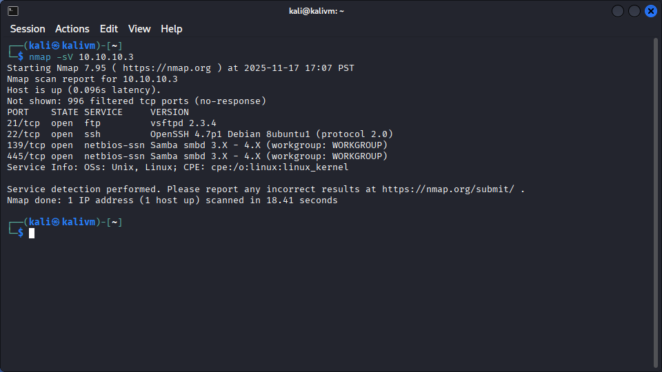
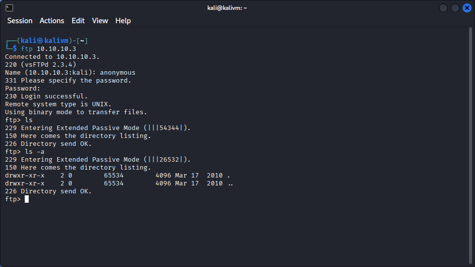
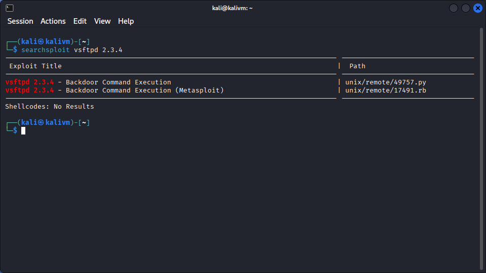
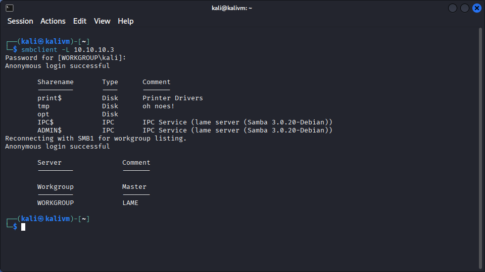
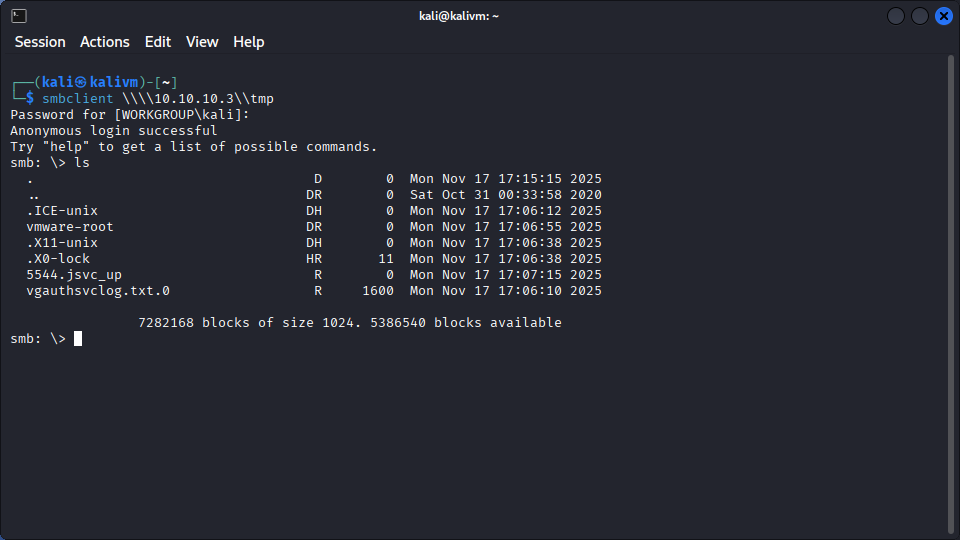
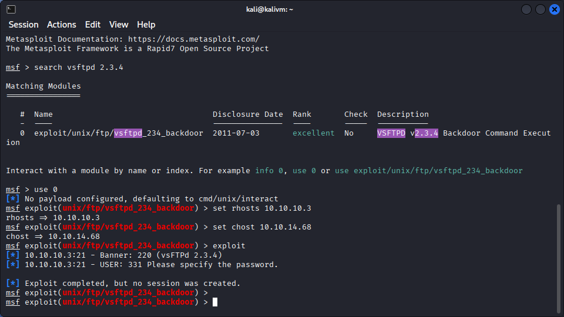
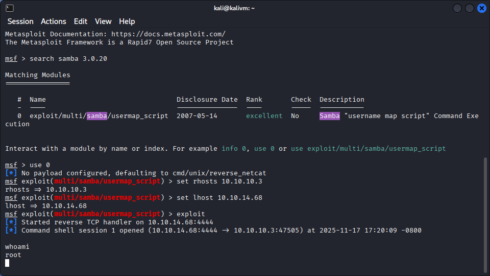
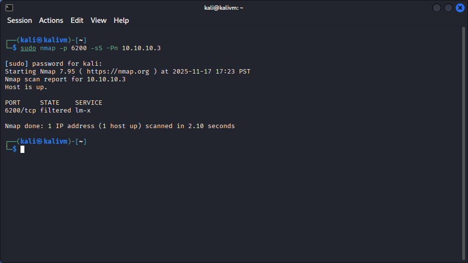

Machine Name: Lame

Released On: 03/14/17

Difficulty: Easy

Completed On: 11/12/25

To begin the process we ran nmap -sV 10.10.10.3 to enumerate services running on the target machine. The result provides us with some useful information.

Now knowing the running services we can begin some basic testing. To begin with I tested the FTP service, starting with testing anonymous logins. Referring back to what I learned in the "Fawn" HTB Starting Point room I connected to the FTP service and provided anonymous as the login name with no password. The connection is successful so I ran a quick ls command to find no listed files or directories. Also ran ls -a to double check that there were no hidden files, which there weren't.

With nothing interesting here the last thing I check for the FTP service is the running version which is vsFTPd 2.3.4. I ran searchsploit vsftpd 2.3.4 to see if there were any known exploits. 

Sure enough there is a backdoor in this version. The exploit corresponds to CVE-2011-2523 and Metasploit has a built in exploit for it. This looks promising but I wanted to gather as much information as possible before attempting an exploit. 

Next up I decide to look into the SSH service running, OpenSSH 4.7p1. This is a significantly outdated version of OpenSSH and there are a few different CVE's that could relate to it. After a quick glance on Google it seems like most of the vulnerabilities are related to information disclosure and were not helpful in getting a foothold on this machine. 

That leaves us with Samba running on ports 139 and 445. The nmap scan did not disclose the full version information so I began with manually testing to see if I could connect to the SMB share without credentials. I remembered from the "Dancing" HTB Starting Point room that if you don't specify a username/password when connecting smbclient will attempt an anonymous login. Sure enough we were able to connect. 

I checked each share to see what was in it, the only one that allowed us to connect was tmp. As seen below none of the contents were of immediate interest. 

At this point I wasn't too sure about the Samba service, nmap provided a range of versions (3.X-4.X) which wasn't too helpful and I didn't see any interesting files exposed. Looking back on this I should have paused here and done more research on enumerating this, why wouldn't nmap provide a specific version? Is there something else I could use to get more info? (More on this later)

I decided to move forward with the exploit found for vsFTPd. I launched Metasploit and selected the exploit we identified earlier. I changed the necessary options then ran the exploit, and... no shell. 

I was hoping this would at least get us our user shell but no dice. With nothing else to investigate I decided there must be something more to Samba and that I should take another look.

I did have to consult the official writeup to dig into Samba more, but I am glad I did because I learned some really valuable things. Firstly, I overlooked using the -sC flag on my nmap scan. This would have enabled the scripting engine and run the default scripts. If I had done this it would have saved time when enumerating the FTP service as nmap tests and tells us that anonymous logins are enabled, as well as it identified Samba 3.0.20 as the version running. (Also while writing this I noticed the version is disclosed when I connected to the SMB share with smbclient, I completely missed this when reading the terminal outputs.) I also learned from the writeup that there is a tool called smbmap which would have samed time as well. I ran this tool using smbmap -H 10.10.10.3 and it not only provided the version of Samba running it also enumerated all the shares and showed that we had read/write access to tmp and no access to everything else. I wish I knew that before I did everything the hard way! 

Now knowing the version I ran searchsploit Samba 3.0.20 to search for exploits and one caught my interest. "Samba 3.0.20 < 3.0.25rc3 - 'Username' map script' Command Execution (Metasploit)"

I fired up Metasploit again and selected this exploit, with all the options set I gave it a shot.. and we got a root shell!

Further research and questions.

#1 Why did the exploit for vsFTPd fail?
It's tough to say as the exploit runs but no shell is obtained. I did a bit more research on the exploit and how the backdoor works. In short when connecting to the vulnerable service with a username ending with :) it spawns a shell on TCP port 6200. I tested manually connecting with the username "tester:)" but when trying to connect to the remote host on port 6200 I get nothing. I followed up that test with running a nmap scan to check if the port is open. 

This runs a nmap SYN scan specifically on port 6200 and skips the host discovery/pinging step. If we receive a SYN/ACK packet from the host it is assumed the port is open, if we receive a RST packet it's assumed the port is closed and if we receive nothing nmap will list it as filtered which likely means the packet is being dropped by a firewall or ACL. In this case we get a filtered, meaning traffic is not going through to the host on port 6200. So the exploit could be working and the shell spawning but we cannot communicate with it.

Lessons and skills learned
#1 I learned I need to practice my nmap skills and knowledge, there is a lot of capability that I am not using that could save time and provide relevant information that I am missing. 

#2 When looking into an unfamiliar service do some research to see if there is a tool that could help the process, in this case if I knew about smbmap I likely would have been able to find the answer without consulting the writeup. As I complete more challenges and get familiar with more services I think the need for this will go down.

#3 Learned how to use Metasploit with some basic exploits. I learned the basic commands like search, show options, set, and exploit. More practice with Metasploit and understanding its capabilities is definitely on my list of things to do.
